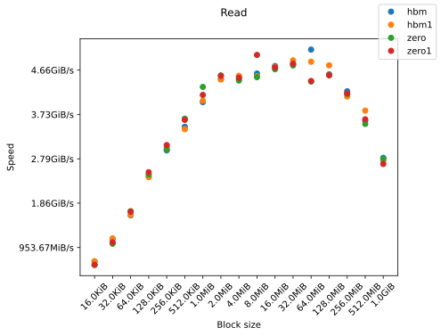
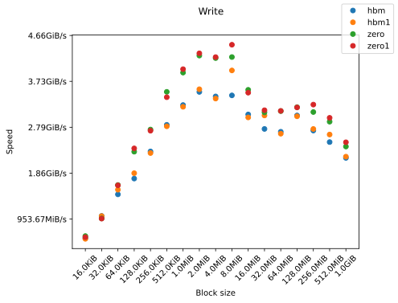

> Note: This file is auto-generated. Do not edit manually. See [Run benchmarks](#run-benchmarks) for more information.

# Benchmarks

## Read



## Write



## Run benchmarks

```sh
# Install dependencies
pip install -r requirements.txt

# Run benchmark for a specific design
sudo python3 bench.py <name_of_design>

# Generate plots and README
python3 gen.py
```
